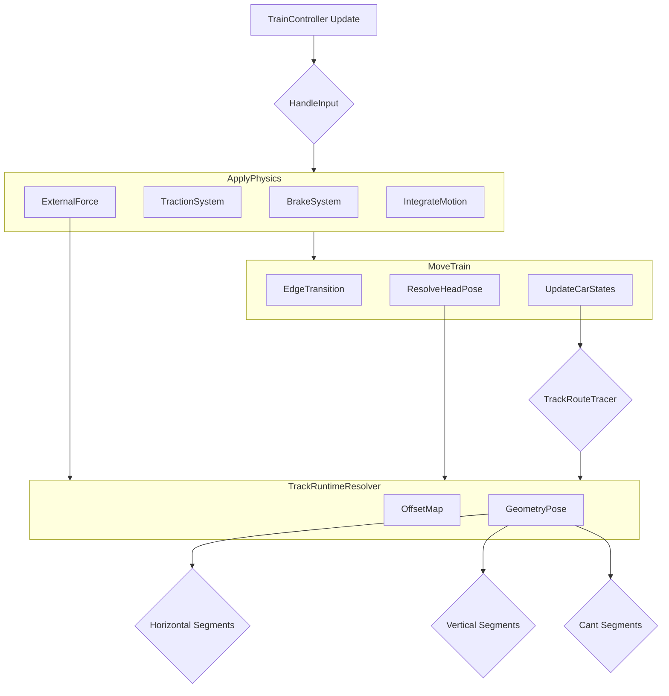

# 走行ロジック＆ジオメトリ生成システム ドキュメント

## 概要

本プロジェクトは、鉄道シミュレーションにおける**走行ロジック**（物理演算）と**ジオメトリ生成ロジック**（線路形状）から構成されています。これらは密接に統合され、車両が線路上を正確に走行できるように設計されています。

---

## 1. 走行ロジック（Train System）

### 1.1 概要

走行ロジックは、以下の4つの主要なフェーズで構成されています：

1.  **入力処理**（HandleInput）
2.  **物理計算**（ApplyPhysics）
3.  **位置更新**（MoveTrain）
4.  **フレーム統合**

これらは`TrainController.cs`の`Update()`ループで**固定順序**で実行されます。

### 1.2 主要ファイル構成

| ファイル | 役割 |
| :--- | :--- |
| `TrainController.cs` | メイン運転制御ロジック |
| `TrainController.Physics.cs` | 物理計算（力学モデル） |
| `TrainController.Track.cs` | 線路上位置・状態管理 |
| `TrainController.Consist.cs` | 編成管理 |
| `BrakeSystemController.cs` | ブレーキ制御 |
| `TractionSystemController.cs` | 力行制御 |
| `ExternalForceCalculator.cs` | 外力計算（走行抵抗、勾配） |

### 1.3 物理モデル

#### 基本運動方程式

$$
F_{net} = F_{traction} - F_{brake} - F_{external}
$$
$$
a = F_{net} / M_{total}
$$
$$
v = v + a \cdot \Delta t
$$
$$
s = s + v \cdot \Delta t
$$

#### 外力計算

**走行抵抗**：
$$
F_{running} = A + B \cdot v + C \cdot v^2
$$

*   A：基本抵抗[N]
*   B：速度依存抵抗係数[N·s/m]
*   C：空力抵抗係数[N·s²/m²]

**勾配抵抗**：
$$
F_{grade} = M \cdot g \cdot \frac{\text{gradient\_permille}}{1000}
$$

### 1.4 主要コンポーネント

#### 1.4.1 TrainController.cs

**主要プロパティ**：

```csharp
public float SpeedMS { get; }          // 現在速度[m/s]
public float SpeedKmH { get; }         // 現在速度[km/h]
public string CurrentEdgeId { get; }   // 現在いるエッジID
public float DistanceOnEdgeM { get; }  // エッジ内位置[m]
public int PowerNotch { get; }         // 現在の力行ノッチ
public int BrakeNotch { get; }         // 現在のブレーキノッチ
public float CurrentAccelerationMS2 { get; }  // 現在加速度[m/s²]
```

**更新フロー**：

```
Update()
  ├─ HandleInput()           // キー入力から手動ノッチ値を設定
  ├─ ApplyPhysics()          // 物理計算（加速度→速度→距離）
  └─ MoveTrain()             // 線路上位置・編成車両姿勢を更新
```

#### 1.4.2 入力処理（HandleInput）

**キーバインディング**：

*   `↑` / `↓`：ノッチを1段上下
*   `←`：ニュートラルに向けて自動段下げ
*   `→`：常用最大ブレーキに向けて自動段上げ
*   `F` / `N` / `R`：逆転器操作（F=前進、N=ニュートラル、R=後進）

**制約**：
逆転器は、速度がほぼ0（≤0.05 m/s）かつ力行ノッチが0の時のみ変更可能

#### 1.4.3 物理計算（ApplyPhysics）

**実行順序**：

1.  **ブレーキシステム更新**
    ```csharp
    brakeSystem.UpdateBrake(brakeNotch, speedMS, deltaTime, isEmergency, ...)
    ```
    *   BC（ブレーキシリンダー）圧力の時間積分
    *   回生ブレーキ可否判定

2.  **力行力計算**
    ```csharp
    float tractionForceN = GetTractionForceN()
    ```
    *   VVVF各ユニットの力行力を合算
    *   `TractionSystemController` が編成各車へ分配

3.  **ブレーキ力取得**
    ```csharp
    GetBrakeOutputs(brakeNotch, ..., out brakeDecelMS2, out brakeForceN)
    ```
    *   `BrakeSystemController` から合算ブレーキ力を取得

4.  **外力計算**
    ```csharp
    float externalForceN = GetExternalResistanceForceN(massKg)
    // = 走行抵抗 + 勾配抵抗
    ```

5.  **加速度計算 & 統合**
    ```csharp
    float netForceN = tractionForceN - brakeForceN - externalForceN
    float acceleration = netForceN / massKg
    IntegrateMotion(acceleration)  // v, s を更新
    ```

#### 1.4.4 位置更新（MoveTrain & Track.cs）

**先頭車姿勢計算**：

```csharp
TryResolveHeadPose(out Vector3 pos, out Vector3 tan, out Quaternion rot)
```

*   `TrackRuntimeResolver` を用いて、`(currentEdgeId, distanceOnEdgeM)` から3D座標と回転を計算

**エッジ遷移処理**：

```csharp
AdvanceEdgeTransitionIfNeeded()
```

*   走行距離がエッジ長さを超えた場合、接続先エッジへ自動遷移
*   最大256回の遷移ガード付き

**編成各車の位置更新**：

```csharp
UpdateCarTrackStates()
```

*   先頭車位置から各車のオフセット距離分だけ後方の線路位置を計算
*   `TrackRouteTracer` により、複数エッジをまたいだ位置計算に対応

### 1.5 ブレーキシステム

#### BrakeSystemController の役割

**BC（ブレーキシリンダー）管理**：

*   BC圧 = 目標値に向けて時間積分で徐々に変化
*   充圧速度：最大120 kPa/s
*   排圧速度：最大180 kPa/s

**ブレーキ力計算**：
$$
F_{brake} = a_{target} \cdot M_{total}
$$
*   `a_target` は `BrakeNotch` から `TrainSpec.GetBrakeDeceleration()` で取得

**回生ブレーキ**：

*   回生ブレーキ採用時は、空気ブレーキを軽減
*   回生失効ラッチ：ブレーキ操作中に回生が失効すると、その操作中は回生を再利用しない

**非常ブレーキ**：

*   `BrakeNotch` ≥ `EmergencyBrakeNotch` の場合、全車最大BC充圧
*   回生ブレーキ無効

#### CarBrakeState

```csharp
public class CarBrakeState
{
    public float regenForceN;              // 回生ブレーキ力[N]
    public float airForceN;                // 空気ブレーキ力[N]
    public float bcPressureKPa;            // BC圧[kPa]
    public bool regenLatchedForCurrentBrake;  // 回生失効ラッチ
}
```

### 1.6 力行システム

#### TractionSystemController の役割

**力行力分配**：

*   モーター搭載車のモーター数に応じて力行力を比例配分
*   非搭載車には0を配分

```csharp
float carShare = carSpec.motorCount / (float)totalMotorCount;
state.tractionForceN = totalTractionForceN * carShare;
```

**編成質量管理**：

*   各車の質量を合算
*   ブレーキ力計算に使用

#### CarTractionState

```csharp
public class CarTractionState
{
    public float tractionForceN;  // 力行力[N]
    public float motorCurrentA;   // モーター電流[A]
}
```

### 1.7 編成管理（Consist System）

#### ConsistDefinition

複数の`CarSpec`を順序付きリストで保持：

```csharp
public List<CarSpec> cars;  // 先頭 → 最後尾
```

#### CarSpec

```csharp
public CarType carType;           // Motor or Trailer
public float lengthM;             // 車両長[m]
public float massKg;              // 質量[kg]
public int motorCount;            // モーター数
public int bcCylinderCount;       // BCシリンダー数
public float bcMaxPressureKPa;    // BC最大圧[kPa]
```

#### 車両位置同期

**CarTrackState配列**：

*   各車の線路上位置を記録
*   先頭車基準のオフセット距離（`offsetFromHeadM`）を保持

```csharp
public class CarTrackState
{
    public int carIndex;               // 何両目か
    public float offsetFromHeadM;      // 先頭車からのオフセット[m]
    public string edgeId;              // 線路ID
    public float distanceOnEdgeM;      // エッジ内位置
    public Vector3 position;           // 3D座標
    public Vector3 tangent;            // レール方向
    public Quaternion rotation;        // 姿勢（勾配・カント含）
}
```

**オフセット計算**：
$$
\text{offset}[i] = \sum_{j=0}^{i-1} \left( \frac{\text{car}[j].\text{length} + \text{car}[j+1].\text{length}}{2} \right)
$$
*   各車中心から次車中心への距離は「半車長の和」

### 1.8 TrainSpec

```csharp
public class TrainSpec : ScriptableObject
{
    // 基本性能
    public float massKg;              // 編成質量[kg]
    public float maxSpeedMS;          // 最高速度[m/s]

    // 走行抵抗
    public float resistanceA;         // 基本抵抗[N]
    public float resistanceB;         // 速度依存係数[N·s/m]
    public float resistanceC;         // 空力係数[N·s²/m²]

    // ノッチ数
    public int maxPowerNotch;         // 力行最大ノッチ
    public int maxBrakeNotch;         // ブレーキ最大ノッチ

    // ブレーキ特性
    public float[] brakeNotchDecelerations;  // 各ノッチの減速度[m/s²]

    // 空気ブレーキ
    public float bcFillRateKPaPerSec;       // 充圧速度[kPa/s]
    public float bcReleaseRateKPaPerSec;    // 排圧速度[kPa/s]
    public float brakeFrictionBaseMu;       // 摩擦係数基準値
}
```

---

## 2. ジオメトリ生成ロジック（Track System）

### 2.1 概要

ジオメトリ生成システムは、線路の**トポロジー**（接続関係）と**形状**（曲線、勾配、カント）を管理し、車両がこれらの形状沿いに走行できるようにします。

### 2.2 主要ファイル構成

| ファイル | 役割 |
| :--- | :--- |
| `TrackGraph.cs` | トポロジー管理（ノード、エッジ） |
| `TrackNode.cs` | ノード定義 |
| `TrackEdge.cs` | エッジ定義 |
| TrackGeometry.cs | 形状定義 |
| `TrackRuntimeResolver.cs` | 形状計算 & Pose解決 |
| `TrackBuilder.cs` | 路線生成ヘルパー |
| `TrackMeshGenerator.cs` | ビジュアルメッシュ生成 |
| `TrackOffsetDistanceMap.cs` | オフセット↔ベース距離マッピング |
| `TrackCurveData.cs` | 曲線データ定義 |

### 2.3 トポロジー（TrackGraph & Node/Edge）

#### TrackGraph

```csharp
public class TrackGraph : ScriptableObject
{
    public List<TrackNode> nodes;              // ノード一覧
    public List<TrackEdge> edges;              // エッジ一覧
    public List<TrackGeometry> geometries;     // ジオメトリ一覧
    public List<TurnoutState> turnoutStates;   // 転てつ状態
}
```

#### TrackNode

```csharp
public class TrackNode
{
    public string nodeId;                   // 一意ID
    public TrackNodeType trackNodeType;     // Normal / Junction / Boundary / Station
    public string junctionId;               // 転てつID（Junction型の場合）
    public Vector3 worldPosition;           // ワールド座標
    public Quaternion worldRotation;        // ワールド向き（前方基準）
    public List<string> connectedEdgeIds;   // 接続エッジID一覧
}
```

#### TrackEdge

```csharp
public class TrackEdge
{
    public string edgeId;                      // 一意ID
    public string nodeAId, nodeBId;            // 両端ノードID
    public float lengthM;                      // エッジ長[m]
    public float speedLimitMS;                 // 速度制限[m/s]
    
    // ジオメトリ関連
    public string baseGeometryId;              // ベースジオメトリID
    public List<TrackOffsetSegment> offsetSegments;  // オフセット情報
    public TrackOffsetDistanceMap offsetDistanceMap; // オフセット変換テーブル
    
    // 信号・閉塞
    public List<BlockSection> blockSections;   // 閉塞セクション
}
```

### 2.4 形状定義（TrackGeometry & Segments）

#### TrackGeometry

```csharp
public class TrackGeometry
{
    public string geometryId;                          // 一意ID
    public float lengthM;                              // 全長[m]
    public float gaugeM;                               // 軌間[m]（標準1.067m）
    
    public Vector3 originPosition;                     // 原点座標
    public Quaternion originRotation;                  // 原点向き
    
    public List<TrackHorizontalSegment> horizontalSegments;  // 水平形状
    public List<TrackVerticalSegment> verticalSegments;      // 垂直勾配
    public List<TrackCantSegment> cantSegments;              // カント角
}
```

#### TrackHorizontalSegment

```csharp
public class TrackHorizontalSegment
{
    public float startDistanceM;        // セグメント開始位置[m]
    public float lengthM;               // セグメント長[m]
    public TrackCurveType trackCurveType;  // 直線 / 円曲線 / 緩和曲線
    public float radiusM;               // 曲率半径[m]（円曲線・緩和曲線）
}
```

#### TrackVerticalSegment

```csharp
public class TrackVerticalSegment
{
    public float startDistanceM;        // セグメント開始位置[m]
    public float lengthM;               // セグメント長[m]
    public float startGradientPermille; // 開始勾配[‰]
    public float endGradientPermille;   // 終了勾配[‰]
}
```

#### TrackCantSegment

```csharp
public class TrackCantSegment
{
    public float startDistanceM;        // セグメント開始位置[m]
    public float lengthM;               // セグメント長[m]
    public float startCantMm;           // 開始カント[mm]
    public float endCantMm;             // 終了カント[mm]
}
```

### 2.5 形状計算（TrackRuntimeResolver）

#### 水平曲線の計算

**クロソイド緩和曲線（TransitionIn）**：
$$
\theta = \frac{s^2}{2RL}
$$
$$
x \approx s \left( \frac{\theta}{3} - \frac{\theta^3}{42} + \dots \right)
$$
$$
z \approx s \left( 1 - \frac{\theta^2}{10} + \frac{\theta^4}{216} - \dots \right)
$$
$$
\text{angle} = \theta
$$

*   s：現在のセグメント内距離
*   R：最終曲率半径
*   L：全緩和曲線長

#### Pose計算（位置・向き）

```csharp
public bool TryResolvePose(
    TrackGraph graph,
    string edgeId,
    float distanceOnEdgeM,
    out Vector3 position,
    out Vector3 tangent,
    out Quaternion rotation)
```

**処理フロー**：

1.  **オフセット距離をベース距離に変換**
    `baseDistanceM = offsetDistanceMap.SampleBaseDistance(distanceOnEdgeM)`
2.  **ベースジオメトリのPoseを計算**
    `TryResolveNativeGeometryPose(baseGeometry, baseDistanceM, ...)`
3.  **オフセットを適用**
    `offsetM = TrackOffsetUtility.EvaluateOffsetAtBaseDistance(...)`
    `position = basePosition + baseRotation * Vector3.right * offsetM`
4.  **接線・回転を計算**
    *   サンプル点との差分から接線を取得
    *   接線とレール上向きから回転行列を構成

### 2.6 オフセット処理（TrackOffset系）

#### TrackOffsetSegment

複数のレール（外軌、内軌など）を同じジオメトリから異なるオフセットで生成：

```csharp
public class TrackOffsetSegment
{
    public float startBaseDistanceM;    // ベースジオメトリ上の開始距離
    public float baseLengthM;           // ベースジオメトリ上の長さ
    public float startOffsetM;          // 開始オフセット
    public float endOffsetM;            // 終了オフセット
    public TrackOffsetCurveType curveType;  // Constant / Linear / Cubic
}
```

#### TrackOffsetDistanceMap

オフセット距離をベースジオメトリの距離に変換するルックアップテーブル：

```csharp
public class TrackOffsetDistanceMap
{
    public float sampleIntervalM = 0.1f;              // サンプル間隔
    public List<float> baseDistanceByOffsetIndex;     // ルックアップテーブル
    
    public float SampleBaseDistance(float offsetDistanceM)  // 補間検索
}
```

### 2.7 路線生成（TrackBuilder）

#### 使用方法

```csharp
var builder = new TrackBuilder(trackGraph);
builder.Start(Vector3.zero, Quaternion.identity);
builder.AddStraight(100f);           // 直線100m
builder.AddClothoidIn(50f, 500f);    // 緩和曲線→
builder.AddCurve(200f, 500f);        // 半径500mの円曲線200m
builder.AddClothoidOut(50f, 500f);   // ←緩和曲線
builder.AddStraight(150f);           // 直線150m
TrackNode endNode = builder.PutNode("Node2");
```

### 2.8 メッシュ生成（TrackMeshGenerator）

#### 処理フロー

1.  **断面プロファイル指定**
    `public Vector2[] profilePoints;`
2.  **沿線に断面をコピー**
    `pos, rot = TryResolvePose(graph, edgeId, distance)`
    `vertex = pos + rot * profilePoint`
3.  **メッシュ構築**
    頂点配列、UV配列、三角形インデックスを生成し、`MeshFilter`へ適用

---

## 3. 統合システム：走行ロジック × ジオメトリ生成

### 3.1 情報フロー



### 3.2 リアルタイム勾配取得

1.  `TrainController` が `currentEdgeId`, `distanceOnEdgeM` を保持
2.  `ApplyPhysics()` で `GetCurrentGradientPermilleForPhysics()` を呼び出し
3.  `TrackRuntimeResolver` が `TryGetGradientPermille()` で照会
4.  内部で `TrackEdge` → `baseGeometryId` から `TrackGeometry` を取得
5.  `TrackOffsetDistanceMap` で offset distance を base distance に変換
6.  `TrackGradientUtility` が `TrackVerticalSegment` から勾配を線形補間
7.  勾配が走行計算に使用される

---

## 4. 実装上の重要ポイント

*   **フレーム順序の厳密性**: `Update()` 内の `HandleInput` → `ApplyPhysics` → `MoveTrain` の順序は固定です。これにより、入力がフレーム遅れなく物理計算と位置更新に反映されます。
*   **オフセット距離とベース距離**: 車両の走行距離はオフセット距離ですが、形状計算にはベース距離が使用されます。これにより、カーブの内外で異なる長さを持つレールを効率的に管理できます。
*   **エッジ遷移時の距離継承**: エッジを越えた際のはみ出し距離は、次のエッジの開始位置に加算され、スムーズな遷移を実現します。
*   **編成車両の位置計算**: 各車両の位置は、先頭車の位置から後方にオフセットをたどることで計算されます。`TrackRouteTracer`が複数エッジをまたぐ計算を処理します。

