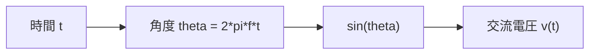
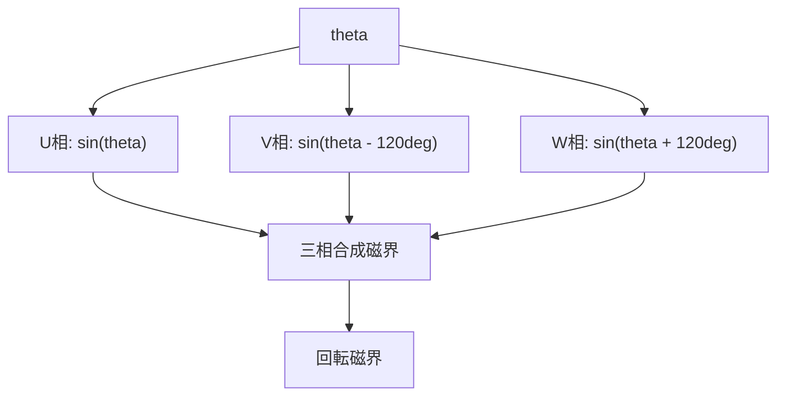
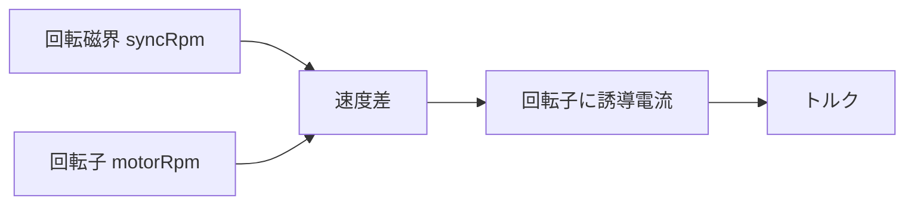
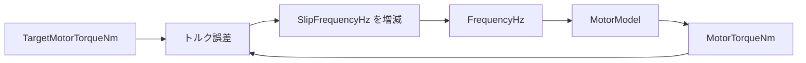
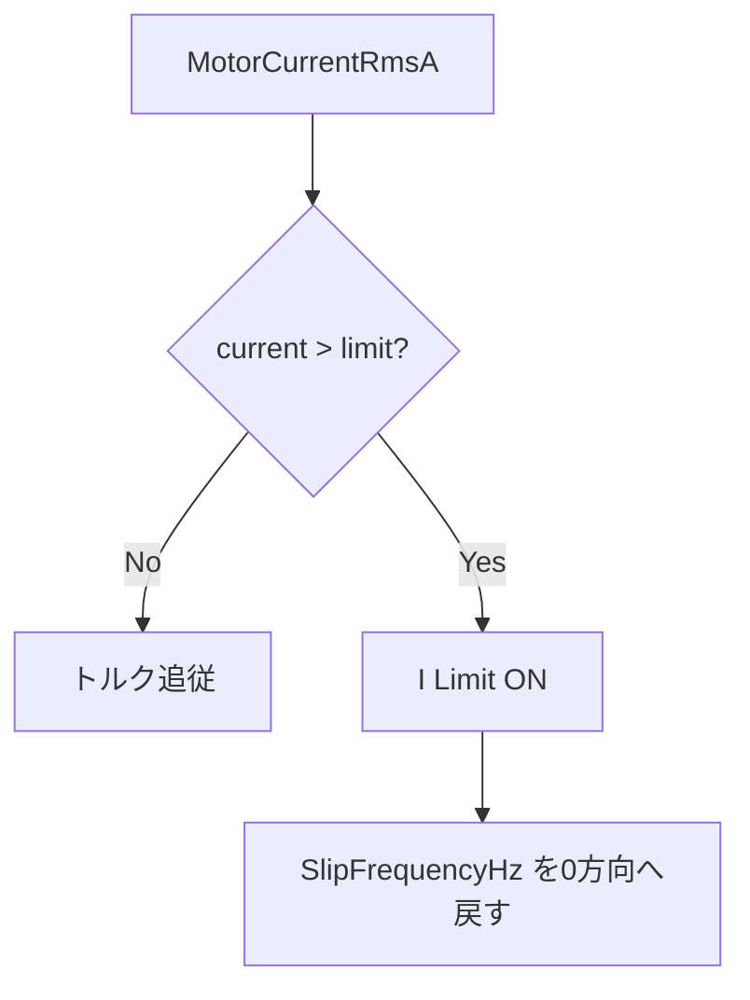
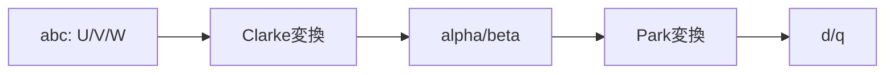
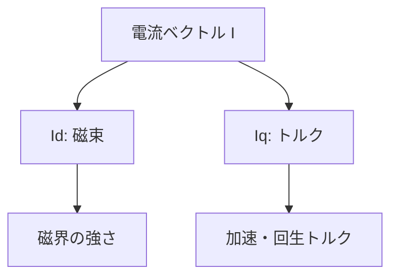
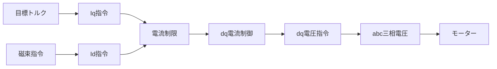

# VVVF・三相交流・ベクトル制御 学習教材

## この教材の目的

この教材は、電気工学としても使える基礎を学びながら、Unity の列車シミュレーターで VVVF、誘導電動機、回生、電流制限、将来的な dq/ベクトル制御を実装できるようになることを目的にしています。

最初から実車の制御論を完全に再現するのではなく、次の順番で理解を積み上げます。

```text
電気の基礎
  -> 交流
  -> 三相交流
  -> 回転磁界
  -> 誘導電動機
  -> VVVF / V/f 制御
  -> すべり周波数制御
  -> 電流制限
  -> dq 変換
  -> ベクトル制御
  -> ゲーム向け簡略モデル
```

既存教材との対応:

- [VVVF_Roadmap.md](VVVF_Roadmap.md): 全体ロードマップ
- [VVVF_Phase1_Waves.md](VVVF_Phase1_Waves.md): 波・三角関数
- [VVVF_Phase2_MotionAndTorque.md](VVVF_Phase2_MotionAndTorque.md): 車両運動・トルク
- [VVVF_Phase3_00_Electricity_Index.md](VVVF_Phase3_00_Electricity_Index.md): 電気の基礎目次
- [VVVF_Phase3_05_TrainVVVFCurrent.md](VVVF_Phase3_05_TrainVVVFCurrent.md): VVVF と電流

## 全体図


今の実装では、おおまかに次に対応します。

```text
VVVFController
  -> FrequencyHz
  -> LineVoltageRmsV
  -> SlipFrequencyHz
  -> VoltageRatio

MotorModel
  -> SlipRatio
  -> MotorCurrentRmsA
  -> RotorCurrentRmsA
  -> MotorTorqueNm
  -> InputActivePowerW

TrainController / BrakeSystemController
  -> 牽引力
  -> 回生ブレーキ力
  -> 空気ブレーキ力
```

## 章 1: 電圧・電流・電力

### ゴール

`V`, `A`, `W` が単なる記号ではなく、シミュレーター上の値として読めるようになる。

### 電気工学としての意味

```text
電圧 V:
  1 C の電荷あたりに持たせるエネルギー

電流 A:
  1 秒あたりに流れる電荷量

電力 W:
  1 秒あたりに移動するエネルギー
```

基本式:

```text
powerW = voltageV * currentA
```

### 実装での意味

モーターへ入る電力は、力行なら正、回生なら負として扱うと分かりやすいです。

```text
力行:
  電気 -> 機械
  InputActivePowerW > 0

回生:
  機械 -> 電気
  InputActivePowerW < 0
```

### 実装メモ

今の `MotorModel` では、電流は次に出ています。

```text
MotorCurrentRmsA
RotorCurrentRmsA
InputActivePowerW
```

電流計や car 表示では、単純な電流の大きさだけでなく、電力やトルクの符号も見る必要があります。

## 章 2: 交流と sin 波

### ゴール

交流を「時間で変化する電圧・電流」として理解する。

### 電気工学としての意味

交流は、大きさと向きが周期的に変わる電気です。

```text
v(t) = Vpeak * sin(2 * pi * f * t)
```



### 実装での意味

今の `VVVFController.UpdateThreePhaseWave()` は、これをそのまま計算しています。

```csharp
UPhaseV = PhaseVoltagePeakV * Mathf.Sin(PhaseRad);
VPhaseV = PhaseVoltagePeakV * Mathf.Sin(PhaseRad - 2f * Mathf.PI / 3f);
WPhaseV = PhaseVoltagePeakV * Mathf.Sin(PhaseRad + 2f * Mathf.PI / 3f);
```

### よくあるバグ

`FrequencyHz` が 0 なのに `VoltageRatio` だけ残ると、物理的に変な状態になります。低速起動時の電流跳ねもここに関係します。

## 章 3: 実効値 RMS とピーク値

### ゴール

なぜ `LineVoltageRmsV` と `PhaseVoltagePeakV` を分けるのか理解する。

### 電気工学としての意味

sin 波の実効値とピーク値は次の関係です。

```text
Vrms = Vpeak / sqrt(2)
Vpeak = Vrms * sqrt(2)
```

三相では線間電圧と相電圧も分かれます。

```text
VphaseRms = VlineRms / sqrt(3)
VphasePeak = VphaseRms * sqrt(2)
```

### 実装での意味

今のコードでは次の関数が対応します。

```text
VVVFMath.GetPhaseVoltagePeakFromLineVoltageRms(...)
VVVFMath.GetPhaseVoltageRmsFromLineVoltageRms(...)
```

電流計や電力計算では、瞬間値より RMS を使うほうが扱いやすいです。

## 章 4: 三相交流

### ゴール

U/V/W の 3 本の交流が 120 度ずれている理由を理解する。

### 電気工学としての意味

三相交流は、3 つの sin 波を 120 度ずらしたものです。

```text
U = sin(theta)
V = sin(theta - 120deg)
W = sin(theta + 120deg)
```



### 実装での意味

3 相波形は、音、表示、電圧計算には使えます。ただしゲーム内の力行力まで瞬間波形で計算すると重くなります。

最初は次のように分けるのが現実的です。

```text
見た目・音:
  U/V/W の瞬間波形

力行・回生:
  RMS 電圧、RMS 電流、周波数、すべり
```

## 章 5: 回転磁界と同期速度

### ゴール

周波数からモーターの同期回転数が決まる理由を理解する。

### 電気工学としての意味

三相交流を固定子コイルに流すと、磁界が回転します。この回転磁界の速度が同期速度です。

```text
syncRpm = 120 * frequencyHz / poleCount
```

例:

```text
frequencyHz = 50
poleCount = 4

syncRpm = 120 * 50 / 4
syncRpm = 1500 rpm
```

### 実装での意味

今のコードでは次に対応します。

```text
FrequencyHz
SyncRpm
VVVFMath.GetSynchronousRpm(...)
```

車輪側から見たモーター回転数は次です。

```text
WheelRpm = speedMS / wheelRadiusM * 60 / (2*pi)
MotorRpm = WheelRpm * gearRatio
```

## 章 6: 誘導電動機とすべり

### ゴール

誘導電動機が、同期速度と実回転速度の差でトルクを作ることを理解する。

### 電気工学としての意味

誘導電動機では、回転子が回転磁界に対して少し遅れることで電流が誘導されます。この差がすべりです。

```text
slipRatio = (syncRpm - motorRpm) / syncRpm
```



### 力行と回生

```text
力行:
  syncRpm > motorRpm
  slipRatio > 0
  電気から機械へエネルギー

回生:
  syncRpm < motorRpm
  slipRatio < 0
  機械から電気へエネルギー
```

### 実装での意味

今の `SlipFrequencyHz` は、回転子基準の周波数に対してどれだけ同期周波数をずらすかです。

```text
FrequencyHz = RotorBaseFrequencyHz + SlipFrequencyHz
```

力行なら `SlipFrequencyHz > 0`、回生なら `SlipFrequencyHz < 0` になります。

## 章 7: VVVF と V/f 制御

### ゴール

周波数だけでなく電圧も変える理由を理解する。

### 電気工学としての意味

コイルのリアクタンスは周波数で変わります。

```text
XL = 2 * pi * f * L
```

周波数を上げると、同じ電圧では電流が流れにくくなります。そこで V/f 制御では、周波数に比例して電圧も上げます。

```text
voltageRatio = frequencyHz / ratedFrequencyHz
```

### 実装での意味

今の実装では次です。

```csharp
targetVoltageRatio = VVVFMath.GetVoltageRatio(
    FrequencyHz,
    motorSpec.ratedFrequencyHz
);
```

低速では起動トルクを出すために電圧ブーストを使います。

```csharp
targetVoltageRatio = Mathf.Max(
    targetVoltageRatio,
    vvvfSpec.launchVoltageBoostRatio * notchRatio
);
```

### よくあるバグ

低速で電圧ブーストが大きすぎると、等価回路上のリアクタンスが小さいため電流が跳ねます。

```text
低周波
  -> リアクタンス小さい
  -> 電流が増えやすい
  -> 電流制限ON
  -> slipを戻す
  -> 加速しない / ハンチング
```

## 章 8: すべり周波数制御

### ゴール

今の `VVVFController` が何をしようとしているか理解する。

### 制御の考え方

現在の方式は、目標トルクと実トルクの差を見て、すべり周波数を動かしています。



### 実装での意味

```text
TargetMotorTorqueNm - actualMotorTorqueNm > 0
  -> 力行側のすべりを増やす

TargetMotorTorqueNm - actualMotorTorqueNm < 0
  -> 回生側のすべりを増やす
```

### 限界

この方式は分かりやすいですが、制御量が間接的です。

```text
本当に制御したいもの:
  トルク
  電流

実際に動かしているもの:
  すべり周波数
```

そのため、低速起動、回生切替、電流制限で不安定になりやすいです。

## 章 9: 電流制限

### ゴール

なぜトルク制御だけでは不十分で、電流制限が必要なのか理解する。

### 電気工学としての意味

電流が大きくなると、次の問題が起きます。

```text
発熱
インバータ素子の負荷
モーター巻線の負荷
保護動作
粘着限界超過
```

### 実装での意味

今の実装では、最大モーター電流が制限値を超えたら、すべり周波数を 0 方向へ戻します。

```text
currentLimitA = ratedCurrentA * currentLimitMultiplier
```



### 改善の方向

より安定させるなら、次も必要です。

```text
電流制限時に電圧も下げる
電流制限にヒステリシスを入れる
電流目標を直接制御する
```

この最後の「電流目標を直接制御する」が dq/ベクトル制御につながります。

## 章 10: dq 変換の入口

### ゴール

三相電流を、磁束成分とトルク成分に分けて考える入口を理解する。

### 電気工学としての意味

三相のままでは、電流が時間で常に変化していて扱いにくいです。そこで座標変換します。

```text
abc（三相）
  -> alpha/beta（固定二軸）
  -> d/q（回転二軸）
```



### d軸と q軸

簡略的には次のように考えます。

```text
d軸電流 Id:
  磁束を作る成分

q軸電流 Iq:
  トルクを作る成分
```



### 実装での意味

ゲーム向けには、まず次の簡略モデルで十分です。

```text
currentA = sqrt(Id^2 + Iq^2)
torqueNm = torqueConstant * Id * Iq
```

力行/回生は `Iq` の符号で表現できます。

```text
Iq > 0 -> 力行
Iq < 0 -> 回生
```

## 章 11: ベクトル制御

### ゴール

今の「すべりを動かして結果を見る」制御から、「電流を直接決めてトルクを作る」制御へ進む。

### 制御構造



### 今の方式との違い

```text
今の方式:
  すべり周波数を動かす
  -> 結果としてトルクと電流が出る

ベクトル制御:
  Id/Iq を決める
  -> 電流制限内で直接トルクを作る
```

### 低速起動で有利な理由

低速では、すべり率%で制限するとトルクが出にくくなります。ベクトル制御では、速度が低くても `Iq` を確保できるので、電流制限内で起動トルクを作りやすいです。

```text
低速:
  すべり率制限方式 -> 許容 slip Hz が小さくなりがち
  dq方式           -> Iq でトルクを直接作る
```

## 章 12: ゲーム向け簡略 dq 制御案

### ゴール

実車完全再現ではなく、今のプロジェクトに移植しやすい制御モデルを設計する。

### 推奨する最初のモデル

```text
入力:
  targetTorqueNm
  motorRpm
  ratedCurrentA
  voltageLimit

内部:
  IdCommand
  IqCommand
  currentLimit
  slipFrequencyHz

出力:
  MotorTorqueNm
  MotorCurrentRmsA
  FrequencyHz
  LineVoltageRmsV
```

### 簡略式

```text
IdCommand = baseMagnetizingCurrentA
IqCommand = targetTorqueNm / max(0.01, torqueConstant * IdCommand)
```

電流制限:

```text
currentMag = sqrt(IdCommand^2 + IqCommand^2)

if currentMag > currentLimit:
    scale = currentLimit / currentMag
    IdCommand *= scale
    IqCommand *= scale
```

トルク:

```text
torqueNm = torqueConstant * IdCommand * IqCommand
```

回生:

```text
targetTorqueNm < 0
  -> IqCommand < 0
  -> torqueNm < 0
```

### 今のコードからの移行順

1. `VVVFController` に `IdCommandA`, `IqCommandA`, `CurrentCommandA` を追加する
2. まだ力行力には使わず、HUDに表示する
3. `TargetMotorTorqueNm` から `IqCommandA` を計算する
4. 電流制限で `Id/Iq` をスケールする
5. `MotorModel` の等価回路トルクと簡略 dq トルクを比較する
6. 安定したら簡略 dq トルクを `MotorTorqueNm` に使う
7. 最後に `slipFrequencyHz` は dq 結果から補助的に計算する

## 最初に実装で確認するデバッグ値

HUD に出すと学習と調整が進みやすい値です。

```text
FrequencyHz
RotorBaseFrequencyHz
SlipFrequencyHz
SlipRatio %
LineVoltageRmsV
VoltageRatio
MotorCurrentRmsA
CurrentLimitA
IsCurrentLimited
MotorTorqueNm
InputActivePowerW
```

dq へ進んだら追加します。

```text
IdCommandA
IqCommandA
CurrentCommandA
TorqueFromDqNm
VoltageLimitRatio
```

## 学習チェックリスト

### 初級

- `Hz` と `rpm` の関係を説明できる
- 三相交流が 120 度ずれていることを説明できる
- RMS とピーク値の違いを説明できる
- `syncRpm = 120 * f / poleCount` を使える

### 中級

- すべり率の正負で力行/回生を説明できる
- V/f 制御で電圧も周波数も変える理由を説明できる
- 低速起動で電流が跳ねる理由を説明できる
- 電流制限がトルク制御より優先される理由を説明できる

### 実装

- `FrequencyHz`, `SlipFrequencyHz`, `MotorRpm` の関係をコードで追える
- `MotorCurrentRmsA` と `InputActivePowerW` から電流計表示の向きを判断できる
- 起動時のハンチングを HUD の `I Limit` で確認できる
- dq 制御の `Id/Iq` をデバッグ表示できる

## 詳細章

この教材をさらに詳しくした章です。学ぶ順番は上から順です。

1. [VVVF_Phase4_ThreePhaseAC.md](VVVF_Phase4_ThreePhaseAC.md)
   - 三相交流
   - 120 度位相差
   - 線間電圧と相電圧
   - 三相波形の実装

2. [VVVF_Phase5_RotatingMagneticField.md](VVVF_Phase5_RotatingMagneticField.md)
   - 回転磁界
   - 周波数と同期速度
   - 極数
   - `FrequencyHz` と `SyncRpm`

3. [VVVF_Phase6_InductionMotorSlip.md](VVVF_Phase6_InductionMotorSlip.md)
   - 誘導電動機
   - すべり率
   - すべり周波数
   - 力行と回生の符号

4. [VVVF_Phase7_VfControlLowSpeedBoost.md](VVVF_Phase7_VfControlLowSpeedBoost.md)
   - V/f 制御
   - 低速電圧ブースト
   - 起動電流
   - 低速での調整

5. [VVVF_Phase8_CurrentLimitProtection.md](VVVF_Phase8_CurrentLimitProtection.md)
   - 電流制限
   - 保護制御
   - ヒステリシス
   - 電流制限時の電圧制御

6. [VVVF_Phase9_DqTransform.md](VVVF_Phase9_DqTransform.md)
   - Clarke 変換
   - Park 変換
   - d 軸 / q 軸
   - dq 電流制限

7. [VVVF_Phase10_GameDqControlImplementation.md](VVVF_Phase10_GameDqControlImplementation.md)
   - ゲーム向け簡略 dq 制御
   - `Id/Iq` 指令
   - dq トルク
   - 既存 `VVVFController` からの移行手順
