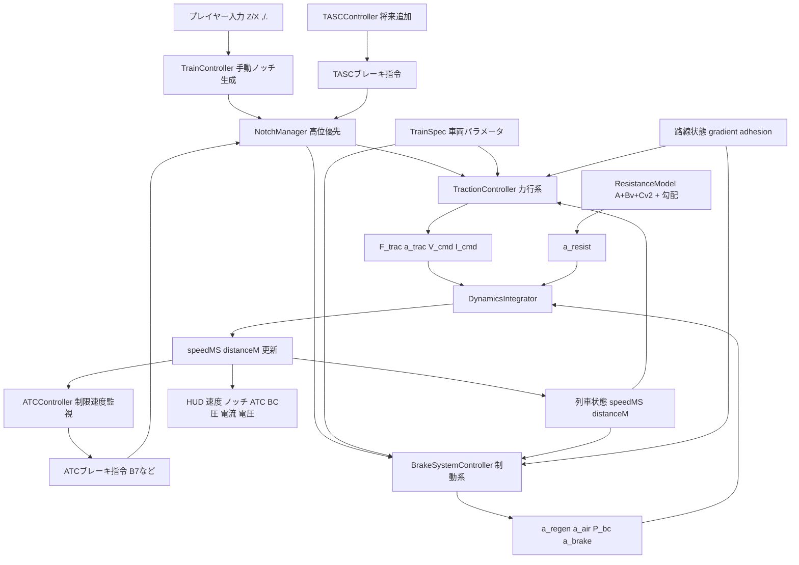

# 加速制御 + 電空協調 Control Flow（入力/出力）

このドキュメントは、加速側（電圧/電流/牽引力）と制動側（回生/空気）を同時に扱うための設計図です。

## 1. 全体フロー図

## 2. 主要計算（最小モデル）

- 力行上限
`F_cap(v) = min(F_torque_cap(v), P_max / max(v, v_min), F_adhesion(v), F_voltage_cap(v))`
- 実牽引力
`F_trac = min(F_cmd(notch), F_cap(v))`
- 力行加速度
`a_trac = F_trac / massKg`
- 電空協調
`a_regen = min(a_req_brake, a_regen_cap(v))`
`a_air_req = max(0, a_req_brake - a_regen)`
`a_air = f(BC圧応答)`
`a_brake = a_regen + a_air`
- 総加速度
`a_total = a_trac - a_brake - a_resist`
- 積分
`speedMS = clamp(speedMS + a_total * dt, 0, maxSpeedMS)`
`distanceM = distanceM + speedMS * dt`

## 3. 入力 / 出力

### 入力

- ノッチ入力
  - `manualPowerNotch`
  - `manualBrakeNotch`
  - `atcBrakeNotch`
  - `tascBrakeNotch`（将来）
- 列車状態
  - `speedMS`（m/s）
  - `distanceM`（m）
- 路線状態
  - `limitSpeedMS`（m/s）
  - `gradient`（‰ or rad）
  - `adhesionMu`
- 車両パラメータ（`TrainSpec`）
  - 牽引: `maxTractionForceN`, `maxTractionPowerW`, `tractionNotchRatios[]`, `powerSpeedCurve`
  - 制動: `brakeNotchDecelerations[]`, `regenCapCurve`, `bcFillRate`, `bcReleaseRate`
  - 制約: `maxSpeedMS`, `massKg`

### 出力

- 物理計算
  - `a_trac`, `a_brake`, `a_resist`, `a_total`
  - `speedMS`, `distanceM`
- モニタ表示
  - `SpeedKmH`
  - `Applied P/B`, `Manual P/B`, `ATC B`
  - `ATC Limit`
  - `P_bc`（kPa）
  - `V_cmd`（V）, `I_cmd`（A）

## 4. 高位優先ルール

- `resolvedBrakeNotch = max(manualBrake, atcBrake, tascBrake, emergencyBrake)`
- `resolvedBrakeNotch > 0` の間は `resolvedPowerNotch = 0`
- ATCはラッチ制御（例: 制限-3km/hまで保持）

## 5. 実装順（推奨）

1. `NotchManager`（完了）
2. `ATCController` ノッチ送信（完了）
3. `TractionController` 追加（未着手）
4. `BrakeSystemController` 追加（未着手）
5. `DynamicsIntegrator` で合成（未着手）
6. HUDへ `P_bc/V_cmd/I_cmd` 表示（未着手）
